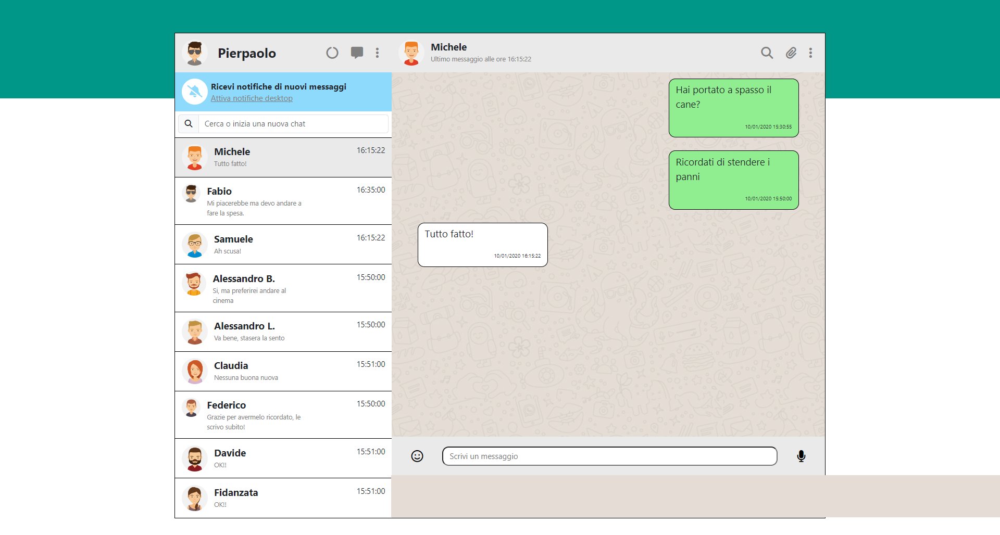

Boolzap - Replica di Whatsapp nelle seguenti parti:
  - riproduzione della grafica
  - visualizzazione messaggi ricevuti e inviati
  - visualizzazione ora e ultimo messaggio inviato/ricevuto nella lista dei contatti
  - visualizzazione dinamica della lista contatti e dei messaggi
  - possibilità di invio messaggio
  - messaggio di risposta automatizzata dopo 1 secondo
  - filtraggio e ricerca delle chat
  - cancellazione del messaggio

Stack:
  - Javascript e Vue
  - Axios
  - Bootstrap
  - HTML, CSS

